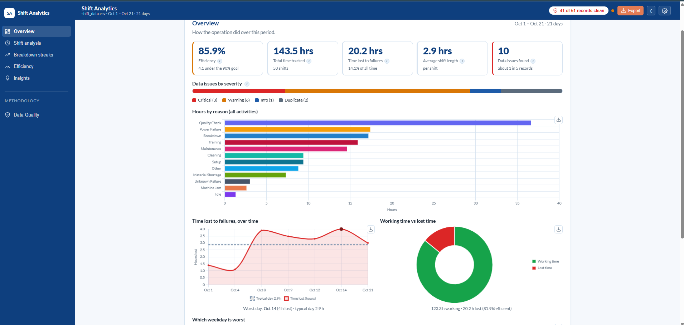

# Shift Analytics Dashboard

**Live demo: [shift-analytics-dashboard.vercel.app](https://shift-analytics-dashboard.vercel.app)**



A web app that turns messy factory shift-log data into a clean operational story. It detects and
handles data-quality issues, scores operational efficiency, finds recurring breakdown streaks, draws
shift and time-based visualizations, and surfaces plain-language insights a plant manager can act on.

It runs two ways:

- **Local mode (default)** — all analysis runs in the browser. No server needed. This is the
  canonical result.
- **Backend mode** — a Django + pandas API recomputes the same numbers with the same
  rules, so both modes always agree. A built-in parity check proves it.

---

## The dashboard

Switch between focused views in the sidebar:

- **Overview** — the headline at a glance: efficiency, total time tracked, time lost to failures, and
  the average shift — plus where the time went by activity, time lost over time, working vs lost time,
  and which weekday is worst.
- **Shift analysis** — how work and lost time split across the morning, afternoon, and night shifts,
  with a timeline of every shift.
- **Breakdown streaks** — when breakdowns happened several days in a row, shown on a day-by-day
  calendar of time lost.
- **Efficiency** — how much of the tracked time was working time versus lost to failures, with the
  week-by-week trend against the goal.
- **Insights** — plain-language decision cards: what to look at, and what to do about it.
- **Data quality check** — what was found and fixed in the raw data before any number was counted:
  every issue type, how it's spotted, and how it's handled.

> Time-based trends (time lost over time, the worst weekday) were once a separate **Trends** view —
> they now live on the Overview.

---
## Features

* **Six analytical views:** Overview, Shift Analysis, Breakdown Streaks, Efficiency, Trends, and Insights.
* **Data quality engine:** Detects and handles operational inconsistencies including invalid dates, impossible or negative hours, timestamp mismatches, missing values, duplicates, cross-midnight shifts, and inconsistent activity labels. All rules and handling decisions are documented transparently.
* **Flexible filtering:** Analyze data using any combination of date range, activity reason, group, shift hours, and activity type.
* **Shift analysis visualization:** Interactive timeline view showing operational activity patterns over time.
* **Additional visualizations:** Downtime calendar, day-of-week patterns, week-over-week comparisons, Pareto analysis of downtime drivers, trend analysis, and data-quality monitoring.
* **Breakdown streak detection:** Identifies recurring breakdown periods using a documented methodology and clearly stated assumptions.
* **Operational Efficiency Score:** Calculates `(Productive Hours ÷ Total Hours) × 100`, where Productive Hours exclude Breakdown and Unknown Failure activities.
* **Actionable operational insights:** Generates data-driven insights with supporting evidence and recommended actions for plant managers.
* **Dynamic category handling:** New activity categories automatically flow into filters, calculations, charts, and reports without code changes.
* **Dual-engine validation:** Browser-based analytics with a Django + pandas backend that mirrors the same logic and supports parity verification.
* **Export & reporting:** Export cleaned datasets, Markdown reports, chart images, and print-ready summaries.
* **Modern user experience:** Responsive layout, dark mode, and a consistent design system optimized for operational analytics.


---

## Tech stack

- **Frontend:** React + Vite (JavaScript), Chart.js, PapaParse (CSV parsing), Inter font (bundled via
  `@fontsource`).
- **Backend:** Django + Django REST Framework + pandas, SQLite.
- **Quality:** ~131 unit tests (Node test runner) plus a local-vs-backend parity script.

---

## Requirements

- Node.js 18+ (tested on Node 22)
- npm 9+
- Python 3.11–3.13 (only needed for the backend mode)

---
## Manual setup

### 1. Frontend (local mode — fully functional on its own)

```bash
cd frontend
npm install
npm run dev
```

Open <http://localhost:5173>.

Production build:

```bash
npm run build
npm run preview
```

### 2. Backend (optional — enables Auto/Backend mode and parity)

In a second terminal:

```bash
cd backend
python -m venv venv
source venv/bin/activate          # Windows: venv\Scripts\activate
pip install -r requirements.txt
python manage.py migrate
python manage.py runserver 8000
```

Then in the app, open **Settings** (the gear, top-right) and set **Source** to **Auto** (uses the
backend when it is running, falls back to local when it is not) or **Backend**.

---
## Quick start (one command)

```bash
git clone https://github.com/Jafrin-Alam-Prima/shift-analytics-dashboard.git
cd shift-analytics-dashboard
./setup.sh
cd frontend && npm run dev
```

Then open the URL Vite prints — usually <http://localhost:5173>. The app loads a sample dataset
automatically.

> **Windows:** run `./setup.sh` in **Git Bash**, or follow the manual steps below.

`setup.sh` installs the frontend dependencies and, if Python is present, creates the backend virtual
environment, installs its dependencies, and migrates the database. If no Python is found it skips the
backend gracefully — local mode still works.

---
## Using the app

- The app loads a bundled sample CSV on start.
- **Upload your own data:** Settings (gear) → upload a CSV, and remap columns if the names differ.
- **Explore:** switch views in the sidebar; use the **Filters** bar to combine date / reason / group /
  hours / type.
- **Data quality:** click the "_X of Y rows clean_" chip at the top (or the **Data Quality** item) to
  see every detected issue and how it was handled.
- **Export:** the **Export** menu (CSV / Markdown / Print) and the per-chart PNG buttons.
- **Dark mode:** toggle in the header.

---

## Expected data

Each row is one shift or incident. The column mapper maps your columns to five logical fields:

| Field    | Meaning                                              |
| -------- | ---------------------------------------------------- |
| `date`   | calendar day                                         |
| `start`  | shift start time                                     |
| `end`    | shift end time                                       |
| `hours`  | recorded duration                                    |
| `reason` | activity / incident type (Breakdown, Power Failure…) |

Renamed columns and brand-new reason categories are handled automatically.

---

## How it works

**Pipeline:** CSV → parse → column map → clean (detect + handle issues) → filter → analyze →
views + export.

Local mode computes everything in the browser (the canonical result). Backend mode sends the same rows
and parameters to the Django/pandas API, which mirrors the exact logic so both agree. Verify it with:

```bash
node scripts/parity-check.mjs   # with the backend running
```

Key definitions:

- **Operational Efficiency Score** = (Productive ÷ Total) × 100, where _Productive_ = hours whose
  reason is **not** Breakdown or Unknown Failure, and _Total_ = sum of all usable shift hours.
- **Breakdown streak** = consecutive calendar days that each contain at least one failure shift;
  severity is graded by total failure hours. The exact assumptions are documented in-app under
  **Breakdown streaks → Method & assumptions**.

The detection rules and how each data issue is handled are documented in-app on the **Data Quality**
page.

---

## Tests

```bash
cd frontend
npm test
```

---

## Deployment (Vercel — frontend only)

The frontend is a static Vite app and runs fully in local mode, so deploying just the frontend gives a
complete, working application.

In Vercel, set:

- **Root Directory:** `frontend`
- **Framework Preset:** Vite
- **Build Command:** `npm run build`
- **Output Directory:** `dist`

The deployed app runs in local mode (the canonical engine) and loads the bundled sample data; users can
upload their own CSV. The Django backend is for local development and the parity check — to run it live,
deploy it separately on a Python-friendly host (Render, Railway, Fly.io) and point the frontend at it.

---

## Project structure

```
shift-analytics-dashboard/
├── frontend/             # React + Vite app (local-mode engine + UI)
│   ├── src/lib/          # pure logic: csv, columnMap, cleaning, analysis, report, filters, ...
│   ├── src/components/   # views, charts, panels
│   └── src/state/        # useDashboard (wires the whole pipeline together)
├── backend/              # optional Django + DRF + pandas API (mirrors the logic)
├── scripts/              # parity check and helpers
├── run.bat               # Windows one-click launcher (double-click to run)
├── run.sh                # macOS / Linux one-click launcher
├── setup.sh              # one-command setup
└── README.md
```
