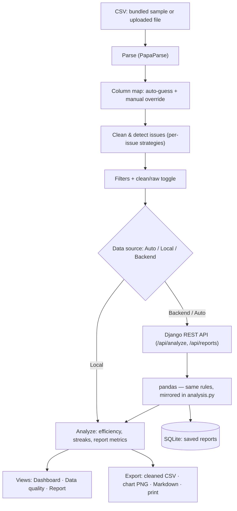

# Shift Analytics Dashboard

A dashboard for messy factory shift data. It cleans the records, scores machine
efficiency, finds breakdown streaks, draws a day-by-day timeline, and surfaces a
few plain-language insights.

It runs two ways:

- **Local mode** — everything is computed in the browser. No server needed.
- **Backend mode** — a Django + pandas API does the same maths with the same
  parameters, so both modes always agree.

The frontend works on its own in local mode; the backend is optional and used by
the **Auto** / **Backend** data-source options.

## Architecture



**How it flows.** A CSV (the bundled sample or an uploaded file) is parsed, its
columns are mapped to five logical fields, then cleaned by the per-issue
strategies. Filters and the clean/raw toggle pick which rows feed the analysis.
The **data-source** switch decides *where* the maths runs: in **Local** mode the
browser computes everything (the pure functions in `frontend/src/lib/`); in
**Backend** mode the same rows + parameters are sent to the Django + DRF + pandas
API, which recomputes with logic mirrored from the JS (so both modes agree) and
persists saved reports in SQLite. Either way the result feeds one unified `view`
that drives the Dashboard, Data-quality, and Report screens and the exports.
**Local is the default and the canonical result;** the backend is optional.

## Requirements

- Node.js 18+ (built and tested on Node 22)
- npm 9+
- Python 3.11–3.13 (only needed for backend mode; tested on 3.13)

## Quick start (one command)

From a fresh clone:

```bash
cd Dashboard-Code
./setup.sh          # installs frontend deps + backend venv/deps + migrates the DB
cd frontend && npm run dev
```

`setup.sh` installs everything in one go (it skips the backend gracefully if no
Python is found — local mode still works). Then open the URL Vite prints (usually
<http://localhost:5173>).

> **Windows:** run `./setup.sh` in **Git Bash**, or do the steps manually:
> `cd frontend && npm install`, then (optional backend)
> `cd backend && python -m venv venv && venv\Scripts\activate && pip install -r requirements.txt && python manage.py migrate`.

## Run the frontend (local mode)

```bash
cd frontend
npm install      # installs the pinned dependencies
npm run dev      # starts Vite
```

Open the URL Vite prints (usually <http://localhost:5173>). The app loads
`frontend/public/shift_data.csv` automatically.

Production build:

```bash
npm run build
npm run preview
```

## Run the backend (optional — for backend mode)

In a second terminal:

```bash
cd backend
python3 -m venv venv
source venv/bin/activate          # Windows: venv\Scripts\activate
pip install -r requirements.txt
python manage.py runserver 8000
```

Set **Source** to **Auto** (uses the backend when it's up, falls back to local
when it isn't) or **Backend** in Settings → Data. The backend analyses the rows
the frontend sends (so uploaded data works in both modes), falling back to the
bundled CSV if none are sent; override the bundled path with
`SHIFT_DATA_CSV=/path/to.csv`.

**What the backend adds:** **saved reports**. The **Reports** view lets you save
the current analysis (dataset + settings) to a small SQLite store, then list,
reload, or delete past ones — something local-only mode can't do. Reports persist
between runs in `backend/db.sqlite3`.

## Verify the two modes agree

With the backend running:

```bash
node scripts/parity-check.mjs
```

It compares the local and backend results on default and non-default settings
(including the alternative streak methods) and prints `PARITY OK`.

## Run the tests

```bash
cd frontend
npm test
```

The suite pins the important numbers (cleaned efficiency ≈ 85.9 %, raw ≈ 75.7 %,
the Oct 8–9 breakdown streak, 10/51 flagged rows) and checks the edge cases
(empty data, no breakdowns, overnight shifts, combined filters, and so on).

## How to use it

- **Dashboard** — KPI cards (efficiency, total hours, shifts shown, longest
  streak), the insights, the floating timeline, and the supporting charts. The
  filter bar at the top is fully combinable (clean/raw, productive/downtime, date
  range, hours range, reasons, groups) with a reset.
- **Data quality** — what was wrong with the data and how it was handled. Each
  issue has a handling control; the defaults reproduce the official numbers.
- **Settings** — remap the CSV columns, and adjust the analysis parameters
  (failure categories, streak method + knobs, grouping). The official Efficiency
  Score stays pinned to the literal formula; any custom failure set shows a
  separate "custom" result on the dashboard.
- **Source bar** (top) — choose Auto / Local / Backend, see the backend status,
  and Retry. In backend mode the controls send their parameters to the API so the
  numbers match local mode exactly.

### Streak methods

Three are selectable in Settings:

- **Consecutive days** (default, official) — calendar days that each have a
  failure shift.
- **Time window** — failures within N hours of each other.
- **Consecutive shifts** — back-to-back failure shifts in the shift sequence.

## The data contract

The app never reads raw column names directly. It maps every column to one of
five **logical fields** — `date`, `start`, `end`, `hours`, `reason` — guessing by
name and data type, with a manual override in Settings. So a CSV with renamed or
reordered columns still works.

## How the numbers are defined

- **Efficiency Score** = `(Productive ÷ Total) × 100`, where *Productive* is the
  hours whose reason is **not** a failure (`Breakdown`, `Unknown Failure` by
  default) and *Total* is all usable hours. If Total is 0 it shows `—`.
- **Hours per row** = recompute `end − start` when both timestamps are valid;
  else use the `HOURS` column if it's `≥ 0`; else the row is excluded.
- **Breakdown streak** = consecutive calendar days that each have at least one
  failure shift (`min_streak_days = 2`, `max_gap_days = 0` by default).

Raw vs clean: *raw* uses the literal `HOURS` column (≈ 75.7 %); *clean* uses the
recomputed hours on de-duplicated rows (≈ 85.9 %).

## Assumptions

- Timestamps are ISO 8601 with a `Z` (UTC); times are read in UTC so dates and
  cross-midnight shifts are stable regardless of the viewer's timezone.
- A duplicate is a row identical in all five fields; the extra copies are dropped.
- A fix only ever uses the row's **own** valid fields — values are never invented
  or borrowed from other rows. A row with nothing usable is left out of the sums.

## Dependencies (pinned)

Frontend — exact versions in `frontend/package.json`, locked in
`frontend/package-lock.json`:

- `react` / `react-dom` 18.3.1
- `chart.js` 4.4.6
- `papaparse` 5.4.1
- `vite` 5.4.10, `@vitejs/plugin-react` 4.3.3

Backend — pinned in `backend/requirements.txt`:

- `Django` 5.1.4
- `djangorestframework` 3.15.2
- `django-cors-headers` 4.6.0
- `pandas` 2.2.3

## Layout

```
Dashboard-Code/
  frontend/
    public/shift_data.csv   the dataset (served at /shift_data.csv)
    src/lib/                pure logic: csv, columnMap, cleaning, analysis, timeline, filters, colors, format
    src/state/              useDashboard hook (the pipeline)
    src/components/         tabs, panels, charts
    tests/                  Node test suites (npm test)
  backend/                  Django + pandas API (Phase 2)
  scripts/profiler.mjs      one-off data profiler
  NOTES.md                  plain-language explanation of each part
```
